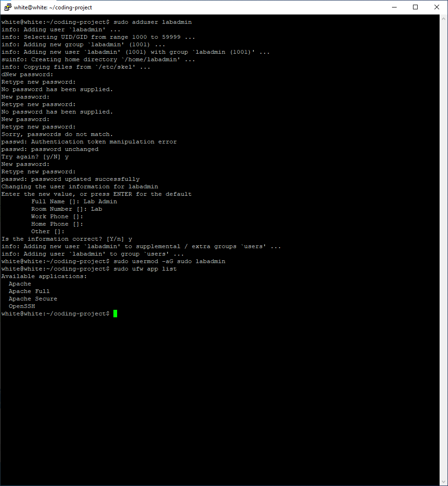
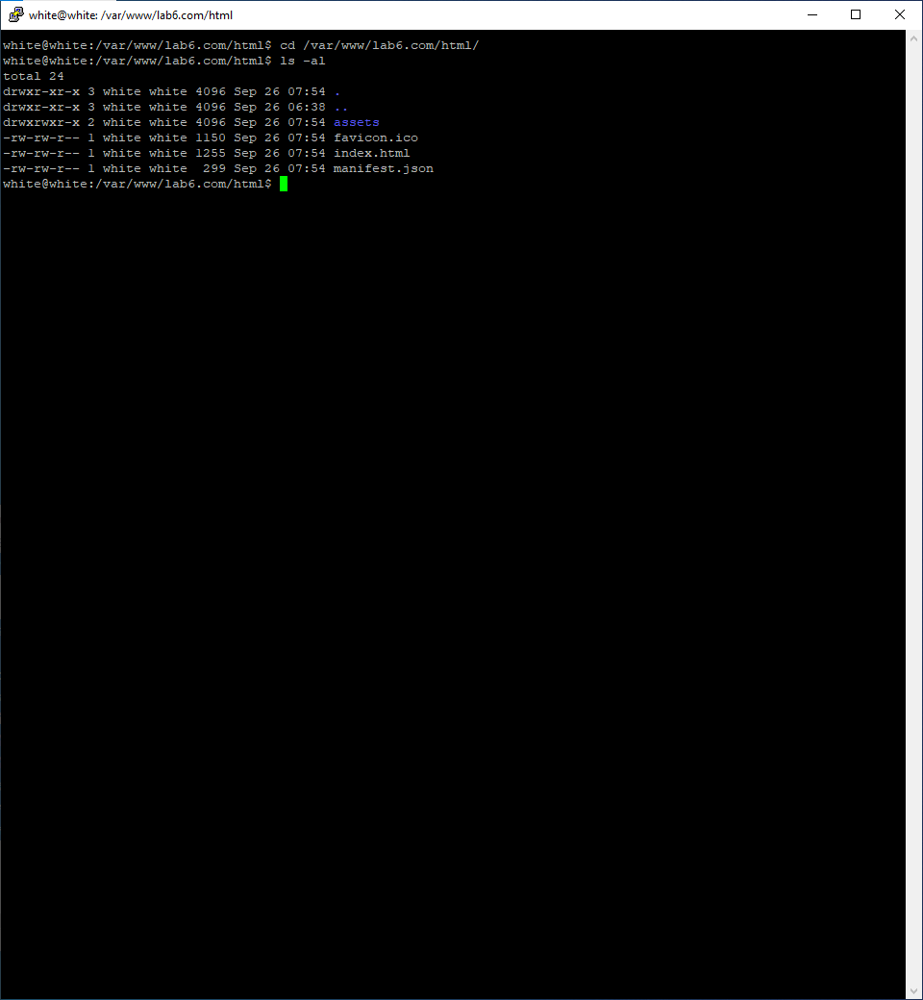

## Lab 6 Nginx - back-end server for Tier1

สร้าง user labadmin และให้สิทธิ์ root

```
sudo adduser labadmin
sudo usermod -aG sudo labadmin
```

และเช็ค firewall

```
sudo ufw app list
sudo ufw allow OpenSSH
sudo ufw enable
sudo ufw status
```




**Step 1** Remove Apache Web Server ที่อาจจะติดตั้งไว้ก่อนหน้า

```
sudo apt-get remove apache2*
sudo apt-get autoremove
sudo apt-get autoclean
sudo rm -rf /etc/apache2 /var/lib/apache2
```


**Step2:** Setting Up New Document Root Directories

```
sudo mkdir -p /var/www/lab6.com/html
ls -l /var/www/lab6.com/
```


จากนั้นให้เปลี่ยน ownership ทั้ง directory ที่สร้างใหม่ให้เป็น user ปัจจุบันที่เราใช้งาน และเปลี่ยนสิทธิการเข้าถึง permissions 

```
sudo chown -R $USER:$USER /var/www/lab6.com
sudo chmod -R 755 /var/www
```


ให้สร้าง ไฟล์ index.html ตัวอย่างสำหรับ web app ของเราCreating Sample Pages for Each Site

```
vim /var/www/lab6.com/html/index.html
```

โดยมีเนื้อหาดังนี้

```
<html>
    <head>
        <title>Welcome to lab6.com!</title>
    </head>
    <body>
        <h1>Success! The lab6.com server block is working! (https)</h1>
    </body>
</html>
```


**Step3:** Nginx (web server) - Backend Server for **Tier1** 

```
— Update your system
sudo apt update && sudo apt upgrade

— Install Nginx, Certbot and Python3-Certbot-Nginx
sudo apt install nginx certbot python3-certbot-nginx

— UFW Firewall Configuration
sudo ufw allow 'Nginx Full'
```


**Step4:** Create Self-Signed SSL Certificate for https (on Local) SSL Certificate กับ NGINX

```
ls /etc/ssl

cd /etc
sudo mkdir ssl

cd ssl
sudo openssl req -x509 -nodes -days 365 -newkey rsa:2048 -keyout server.key -out server.crt 

```


```
sudo openssl dhparam -out /etc/nginx/dhparam.pem 4096
```


**Step5:** Configuring Nginx to Use SSL

```
sudo vim /etc/nginx/snippets/self-signed.conf
```

มีเนื้อหาดังนี้

```
ssl_certificate /etc/ssl/server.crt;
ssl_certificate_key /etc/ssl/server.key;
```


```
sudo vim /etc/nginx/snippets/ssl-params.conf
```

เนื้อหาดังนี้

```
ssl_protocols TLSv1.3;
ssl_prefer_server_ciphers on;
ssl_dhparam /etc/nginx/dhparam.pem; 
ssl_ciphers EECDH+AESGCM:EDH+AESGCM;
ssl_ecdh_curve secp384r1;
ssl_session_timeout  10m;
ssl_session_cache shared:SSL:10m;
ssl_session_tickets off;
ssl_stapling on;
ssl_stapling_verify on;
resolver 8.8.8.8 8.8.4.4 valid=300s;
resolver_timeout 5s;
# Disable strict transport security for now. You can uncomment the following
# line if you understand the implications.
#add_header Strict-Transport-Security "max-age=63072000; includeSubDomains; preload";
add_header X-Frame-Options DENY;
add_header X-Content-Type-Options nosniff;
add_header X-XSS-Protection "1; mode=block";
```


**Step6:**  Adjusting the Nginx Configuration to Use SSL

```
cd /etc/nginx/
ls -l

cd sites-available

sudo vim /etc/nginx/sites-available/lab6.com
```

เนื้อหาดังนี้

```
server {
    listen 443 ssl;
    listen [::]:443 ssl;
    include snippets/self-signed.conf;
    include snippets/ssl-params.conf;

    server_name lab6.com www.lab6.com;

    root /var/www/lab6.com/html;
    index index.html index.htm index.nginx-debian.html;
}

server {
    listen 80;
    listen [::]:80;

    server_name lab6.com www.lab6.com;

    return 302 https://$server_name$request_uri;
}
```

**Step7:** Enabling your Server Blocks and Restart Nginx

```
sudo ln -s /etc/nginx/sites-available/lab6.com /etc/nginx/sites-enabled/
```


**Step8:** Adjusting the Firewall

```
sudo ufw app list
sudo ufw status
sudo ufw allow 'Nginx Full'
sudo ufw delete allow 'Nginx HTTP'
sudo ufw status

sudo nginx -t
sudo systemctl restart nginx
```


**Step9:** Testing http และ https

```
https://192.168.56.101/
```


**Step10:** Deploy React.js template to Nginx web server


git clone มาที่เครื่อง local


```
cd coreui-free-react-admin-template/
npm install
```


ทดสอบการทำงาน local

```
npm start
```


build เอาไปรันบน VM

```
npm run build
```


ย้ายจาก `./build/*` ไปยัง VM

```
scp -r ./build/* labadmin@192.168.56.101:/var/www/lab6.com/html
```


กลับไปที่ VM ไปดูสิ่งที่ย้ายมา

```
cd /var/www/lab6.com/html/
ls -al
```



ลองเข้าไปดูทดสอบ

```
https://192.168.56.101/
```

